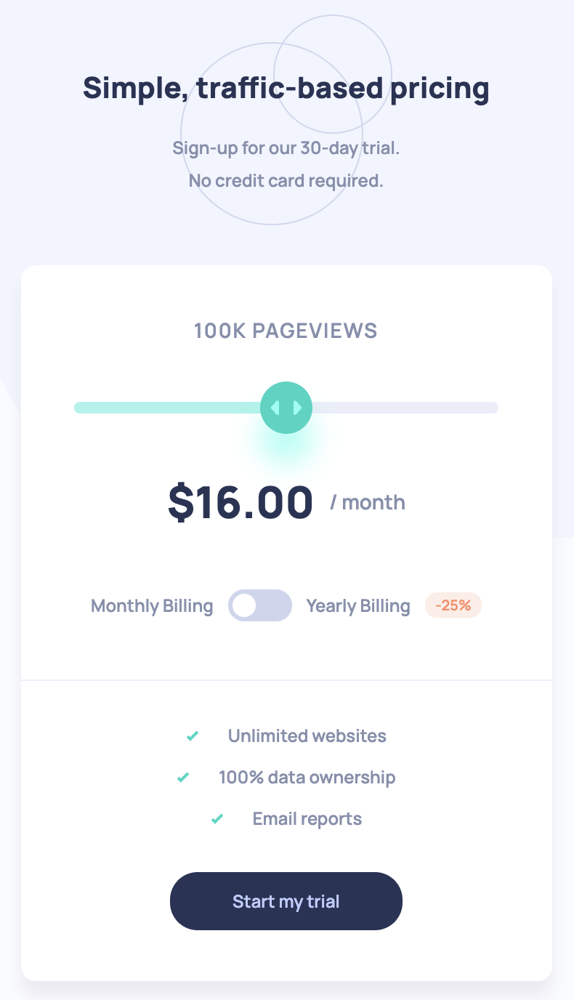
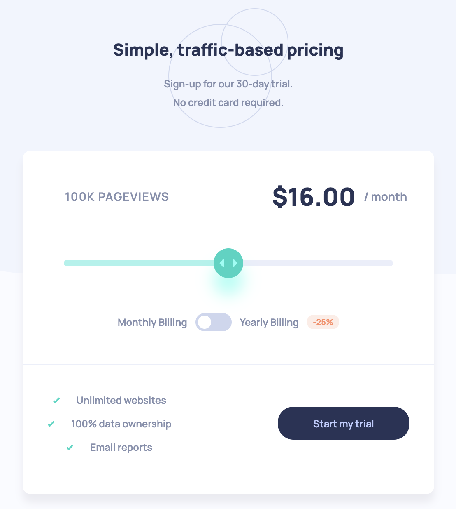

# Frontend Mentor - Interactive pricing component solution

This is a solution to the [Interactive pricing component challenge on Frontend Mentor](https://www.frontendmentor.io/challenges/interactive-pricing-component-t0m8PIyY8). 

## Table of contents

- [Overview](#overview)
  - [The challenge](#the-challenge)
  - [Screenshot](#screenshot)
  - [Links](#links)
- [My process](#my-process)
  - [Built with](#built-with)
  - [What I learned](#what-i-learned)
  - [Continued development](#continued-development)
- [Author](#author)

## Overview

### The challenge

Users should be able to:

- View the optimal layout for the app depending on their device's screen size
- See hover states for all interactive elements on the page
- Use the slider and toggle to see prices for different page view numbers

### Screenshot




### Links

- Solution URL: [Github](https://github.com/nicol29/interactive-pricing-component-fm)
- Live Site URL: [Github Pages](https://nicol29.github.io/interactive-pricing-component-fm)

## My process

### Built with

- Semantic HTML5 markup
- CSS custom properties
- Flexbox
- CSS Grid
- Mobile-first workflow
- [React](https://reactjs.org/) - JS library
- TypeScript
- Vite

### What I learned

I primarily picked this challenge to learn how to drag and drop, as this challenge featured a slider component which I had not yet implemented before. It was a great way to put my knowledge to the test.

One of the main obstacles was to figure out the position of the cursor relative to the slider. The following code found this value as a percentage which was then used to set the inner sliders width to.

```js
const barWidth = searchBar?.getBoundingClientRect().width;

if (e.touches) {
  startPos = e.touches[0].clientX - searchBar?.getBoundingClientRect().left;
} else {
  startPos = e.clientX - searchBar?.getBoundingClientRect().left;
}
const percentage = (startPos / barWidth) * 100;

return (percentage > 100) ? 100 : percentage;
```

### Continued development

I would like to start getting familiar with testing my react components now as I feel like its becoming an industry standard. Along with this it will save time by potentially avoiding bugs in my code. 

Jest will be the next tool to learn.


## Author

- Github - [nicol29](https://github.com/nicol29)
- Frontend Mentor - [nicol29](https://www.frontendmentor.io/profile/nicol29)
